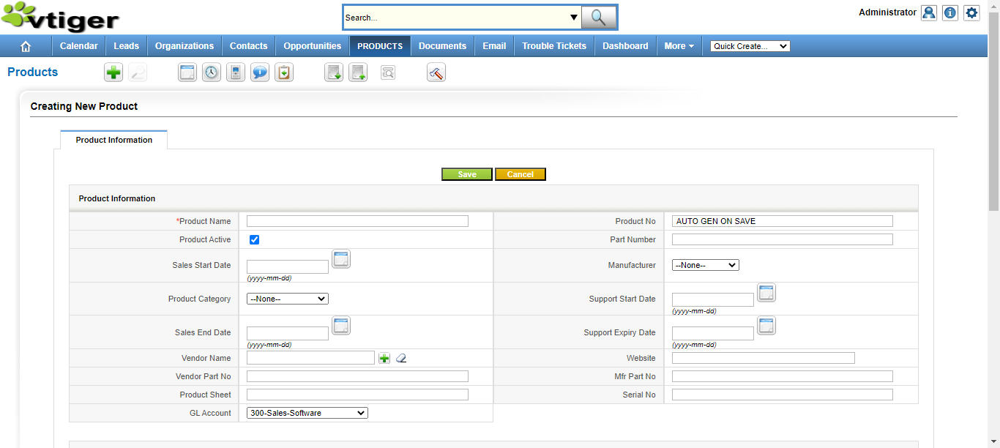

This is the sample project that I completed during my course at Qspider to become a Java QA Automation Engineer.Using knowledge gained throughout the course to develop a testing framework for a VTIGER application.

## Project Title:

An End to End Selenium Webdriver Project with Java for Automation Practice on VTIGER application.This framework is related to Create Product , Delete Product , Create Organisation , Create Campaign , Create CampaignAndProduct and Create OrganisationAndContact  using data driven method for run.

## Technology Stack:

1.Programming language - Java

2.Build and project management tool - Maven

3.Testing framework - TestNg

4.Automation framework - Selenium WebDriver

5.Reporting framework - extent report

## Test Cases covered in this project:

✅1. Test Case - Automate 'Create Product' process.

Steps to Automate:

   1.Open this url http://localhost:8888/
   
   2.Enter your Username and Password.

   3.Click on Login.

   4.Click on products link.

   5.Click on plus image. 
 
   6.Creating New Product page opens.

   7.Enter "Product name". 

   8.Click on save.

   9.Validating the headerName with the productName.

   10.Mouseover on administrator image and click on Sign Out.

   
##Note: 

USERNAME: admin and
PASSWORD: admin

✅2. Test Case - Automate 'Delete Product' process.

Steps to Automate:
   
   1.Open this url http://localhost:8888/
   
   2.Login to application.

   4.Click on products link.

   5.Click on plus image. 
 
   6.Creating New Product page opens.

   7.Enter "Product name". 

   8.Click on save.

   9.Click on "Delete". 

   10.Mouseover on administrator image and click on Sign Out.

✅3. Test Case - Automate 'Create Organisation' process.

Steps to Automate:

   1.Open this url http://localhost:8888/
   
   2.Login to application.

   4.Click on Organizations link.

   5.Click on plus image. 
 
   6.Creating New Organization page opens.

   7.Enter "Organization name". 

   8.Click on save.

   9.Validating the headerName with the Organization Name.

   10.Mouseover on administrator image and click on Sign Out.

✅4. Test Case - Automate 'create Campaign' process. 

Steps to Automate:

   1.Open this url http://localhost:8888/
   
   2.Login to application.

   3.Mouseover on More link.

   4.Click on Campaigns link.

   5.Click on plus image. 
 
   6.Creating New Campaigns page opens.

   7.Enter "Campaign name". 

   8.click on save.

   9.Validating the headerName with the Campaign Name.

   10.Mouseover on administrator image and click on Sign Out.

✅5. Test Case - Automate 'Create Product along with Campaign' process.

Steps to Automate:

   1.Open this url http://localhost:8888/
   
   2.Login to application.

   3.Click on Products link.

   5.Click on plus image. 
 
   6.Creating New product page opens.

   7.Enter "Product name". 

   8.click on save.

   9.Validating the headerName with the productName.

  10.Mouseover on More link.

  11.Click on Campaigns link.

  12.Click on plus image. 
 
  13.Creating New Campaign page opens.

  14.Enter "Campaign name". 

  15.Click on Product's plus image.

  16.Enter the Product name in search text box and click on search.

  17.Select the entered Product. 

  18.click on save.

  19.Mouseover on administrator image and click on Sign Out.

  ✅6. Test Case - Automate 'Create Organization along with Contact' process.

Steps to Automate:

   1.Open this url http://localhost:8888/
   
   2.Login to application.

   3.Click on Organizations link.

   5.Click on plus image. 
 
   6.Creating New Organization page opens.

   7.Enter "Organization name". 

   8.Click on save.

   9.Validating the headerName with the Organization Name.

  10.Click on Contact link.

  11.Click on plus image. 

  12.Creating New Contact page opens.
 
  13.Enter "Last name".

  14.Click on Organization's plus image.

  15.Enter the Organization name in search text box and click on search.

  16.Select the entered Organization. 

  17.click on save.

  18.Mouseover on administrator image and click on Sign Out.

 
   

## Documentation

[BATCHEXECUTION](vtigerproject/BATCHexecutiontestng.xml)

[CROSSBROWSEREXECUTION](vtigerproject/CROSSbrowsertestng.xml)

[GROUPEXECUTION](vtigerproject/GROUPexecutiontestng.xml)

[ItestListnerCLASS](vtigerproject/ITestListnertestng.xml)

[LISTNERCLASS](vtigerproject/Listnertestng.xml)

[PARALLELEXECUTION](vtigerproject/PARALLELdistributedtestng.xml)

[RegionalRegressionCLASS](vtigerproject/RegionalRegressiontestng.xml)

[Extentreport](vtigerproject/extentreport.html)

## Screenshots
Screenshot of failure testcase by LISTNERCLASS:

